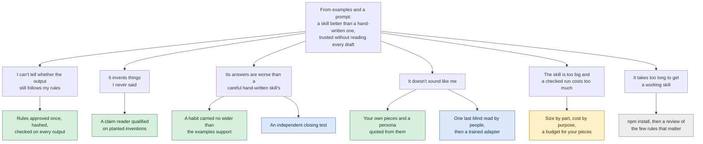

# Yannick Maurice

**I'm a product leader in San Francisco, technical across hardware, software and infrastructure at scale.**

I've worked on motor control systems, LiDAR traffic intelligence for safety infrastructure, ML for battery analytics, mobile EV charging, grid orchestration for distributed energy, and space awareness for sovereign environments. Now it's AI systems for strategic work.

The throughline: make the technology disappear, and absorb the complexity so the person using it doesn't have to.

## Portfolio

**[Atelier](https://github.com/yannickYamo/atelier)** turns examples of the work you want into an AI skill, with rules you approve once that no model update can move. Every output is checked against them and anything invented is cut, so you get work in your voice, run after run, without reading each draft.

**[receipts](https://github.com/yannickYamo/receipts)** is a guard for AI agents that research the web: every claim carries a quote from a page that code fetched, or it gets cut. You can repeat what an agent tells you without redoing the research, and every cut is listed with its reason.

**[depot-twin](https://github.com/yannickYamo/depot-twin)** is a digital twin of a robotaxi depot on a real East Oakland parcel that tells you how many vehicles one site's grid connection can carry, what breaks first as the fleet grows, and which charging rules get the most from its power.

**[Epitaph](https://github.com/yannickYamo/epitaph)** is an art installation where a language model runs on a small computer that I take away from it piece by piece while it's still thinking, until it dies and a new one is born. You get to watch how much of what a mind says comes from the mind, and how much from the machine shrinking around it.

**[skills](https://github.com/yannickYamo/skills)** is a set of AI skills for Claude Code covering product marketing, strategy and go-to-market. You get an agent that does that work the way a senior operator would, from the first run.

**[StratOS](https://getstratos.ai)** helps early-stage teams decide who to sell to, what to say, what to charge and what to build next. Their agents read those decisions before building anything. Each decision spells out what would prove it wrong, and StratOS flags it when that happens.

## Where Atelier is going, and why

I plan it as an opportunity solution tree: one outcome, the problems between people and it, what I built or will build for each, and the test that decides whether it worked.

**The outcome.** From a folder of examples and a prompt, you get a skill that's better than a careful hand-written one, and you can rely on it without reading every draft. It's counted against two public hand-written skills: at least 20% fewer failures, tested once by someone who isn't me. A miss gets published as a miss.

Green is built with a measurement behind it, yellow is built and waiting for its measurement, blue is the next test, gray is decided for later.

| The problem, in the words people use | Why it's on the tree | Where it stands |
|---|---|---|
| I can't tell whether the output still follows my rules | A skill nobody can check has to be read draft by draft | Answers breaking a counted rule: 31% against 76% for a hand-written skill, in development |
| It invents things I never said | One invented figure costs more trust than every rule held | All 46 planted inventions caught; 39 of 48 clean drafts left alone |
| Its answers are worse than a hand-written skill's | That's the bar | Failed answers 15.0% against 25.4% on 60 held-out tasks, in development; writing is still behind on the other skill's own score |
| It doesn't sound like me | Rules describe a writer, they don't sound like one | The least solved branch, and not claimed. Three approaches failed and are published; one blind read by people is left |
| The skill is too big | A reviewer measured it at 16 to 38 times the size of a hand-written skill | On the one skill I measured part by part, seven words in ten are your own pieces served whole. One study, drafted, selects a smaller default if one stands against today's |
| It takes too long to get a working skill | Most people say "review code like our principal engineer", not "ratify a standard" | First thing after the closing test |

I don't add a mechanism because a result disappointed. Each branch has one test, written before it runs, and the result goes in the record either way. The full tree, with the evidence under every branch, is in the [roadmap](https://github.com/yannickYamo/atelier/blob/main/docs/ROADMAP.md).

## How I think

Models are getting cheaper at everything objective. What stays scarce is the part that was always hardest to write down: what to emphasize, what to ignore, what feels wrong despite looking reasonable, which technically correct answer you'd never ship.

Agents now produce more than I can read. They can't own the outcome, and my attention doesn't scale with how many of them I run. My part is deciding what good looks like and checking that the work meets it.

Hardware taught me you can't hide behind iteration. You have to understand a thing all the way down to build it simply.
